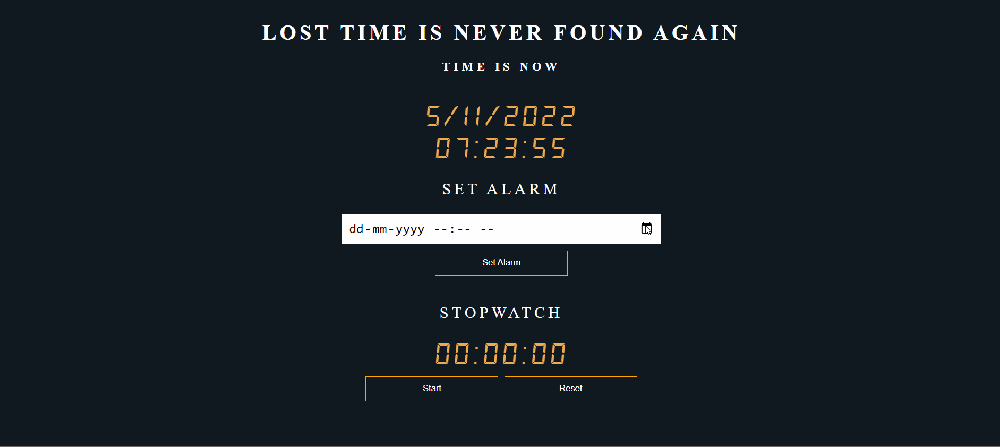

## My Watch
My Watch is elegant looking and responsive web app based on JavaScript which allows different functionality just like digital watch. Made with the purpose of learning JavaScript.

### Contains
- [x]  Current Time & Date
- [x]  Alarm Clock
- [x]  Stop Watch

### Tech Stack Used
- HTML
- CSS
- JavaScript

### Demo

Gif - My Watch Functionality

 

Image 1 - Desktop View

 

Image 2 - Mobile View

 